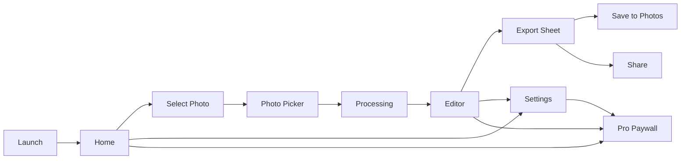

# iOS App UX Alignment v1

## Purpose

This document locks the recommended user flow, screen structure, editing logic, and monetization behavior for the iOS version of the portrait cutout app.

The goal is to align before large UI implementation starts.

## Final Recommendations

### Product Decisions

- App type: offline-first portrait cutout editor
- Release strategy: global App Store release
- AI strategy: local visual AI first, replaceable advanced segmentation engine later
- Monetization: StoreKit 2 subscription and Pro unlock
- Licensing: no activation codes on iOS
- V1 export priority: PNG first, JPG optional, PLT postponed

### UX Decisions

- Navigation model: single-stack flow, not a tab-bar-first product
- Main user journey: Home -> Photo Pick -> Processing -> Editor -> Export
- Settings should be secondary, reachable from Home and Editor
- Processing must be immediate after photo selection
- Editing must keep controls shallow and thumb-friendly

### Visual Decisions

- Overall shell: bright premium
- Preview area: dark neutral canvas for contrast
- Personality: professional photo utility, not playful AI toy

## Primary User Flow

## Navigation Logic

Recommended root architecture:

- `NavigationStack`
- Home as root
- photo picker as system sheet
- processing as full-screen loading state or overlay
- Editor as pushed destination
- Export as bottom sheet
- Settings as pushed page or sheet
- Paywall as sheet

Why:

- better for one-task utility apps
- less chrome than a tab bar
- keeps the user focused on the image
- easier to localize cleanly

## Screen Structure

## 1. Home

Purpose:
- start fast
- show app value
- expose recent work

Content blocks:
- title / brand area
- primary button: `Select Photo`
- recent projects strip
- sample showcase cards
- small Pro card
- settings button

Behavior:
- selecting a photo should immediately begin AI processing
- no extra setup required

## 2. Processing

Purpose:
- keep the user informed during AI work

Content:
- large progress bar
- large percentage
- stage label
- image thumbnail
- short localized message

Stages:
- Loading photo
- Detecting subject
- Segmenting portrait
- Refining edges
- Rendering result
- Preparing export

Behavior:
- no fake looping state if the backend has real progress
- if the stage is unknown, use calm indeterminate motion

## 3. Editor

Purpose:
- give fast control over result quality without overwhelming the user

Top area:
- preview canvas
- before / after toggle
- zoom and pan gestures

Toolbar:
- back
- reset
- export

Bottom controls:
- Shape
- Color
- Background
- Clarity
- Advanced

Behavior:
- controls change preview instantly
- one control panel open at a time
- default state should already look export-ready

## 4. Export

Purpose:
- save or share in the right format with minimal friction

Sections:
- format
- resolution
- background output
- save
- share

V1 recommendation:
- PNG
- JPG
- transparent output
- black or white background output

Postpone:
- PLT as a mainstream export surface in iOS v1

## 5. Settings

Purpose:
- low-frequency controls

Sections:
- Pro status
- restore purchases
- language
- privacy
- support
- app version

## 6. Paywall

Purpose:
- convert users without blocking basic trust-building

Best moment to show:
- after user sees a successful result
- during export or high-resolution export

Avoid:
- hard block before first success

## Editing Logic

### Core Editing Tools For V1

- Shape
  - Circle Transparent
  - Circle Solid
  - Square Transparent
  - Square Solid

- Color
  - Original
  - Grayscale
  - Black and White

- Background
  - Transparent
  - Black
  - White
  - Custom color later

- Clarity
  - Soft
  - Standard
  - Sharp

### Advanced Panel

V1 recommendation:
- expose only one advanced switch
- `High Precision`

Behavior:
- hidden behind Pro or labeled as advanced
- useful for hair, veil, bouquet, and complex background images

## Free vs Pro UX Split

Recommended split:

### Free

- standard local cutout
- preview editor
- limited exports
- medium resolution output

### Pro

- unlimited exports
- high-resolution output
- high precision mode
- future advanced export modes

UX rule:
- free users must still get a real usable result
- Pro should remove limits and add quality, not just remove pain

## Localization Rules

- all user-facing strings must be short and neutral
- no culture-specific slang
- no "magic AI" wording
- every label must survive longer translations

Examples:

- use `Select Photo` instead of long descriptive phrases
- use `Original`, `Grayscale`, `Sharp`, `Export`

## Error and Recovery Logic

### Case: no clear subject found

Show:
- `We could not find a clear subject. Try another photo or use High Precision.`

Actions:
- Retry
- Choose Another Photo
- High Precision

### Case: low-light complex scene

Show:
- `This photo is difficult. High Precision may improve the result.`

### Case: export blocked by Pro

Show:
- value-based explanation
- not a generic locked-state wall

## Recommended Screen Order For Implementation

1. Home
2. Processing
3. Editor shell
4. Export sheet
5. Paywall
6. Settings

## Decisions Locked In This Version

- no tab bar first
- no activation code
- no PLT in iOS public v1 path
- bright premium shell
- dark preview canvas
- StoreKit 2
- local AI first
